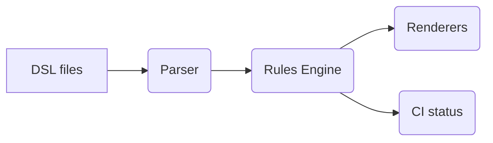

- **Parser** for Perilscribe DSL → AST
- **Rules engine** (policy.toml) → scoring & checks
- **Aggregators** for AND/OR logic across attack paths
- **Renderers** → HTML/PDF/CSV/SVG

**Integrations (planned):** Stripe/Lemon Squeezy for premium, Neo4j export, AI‑assisted scaffolding.

